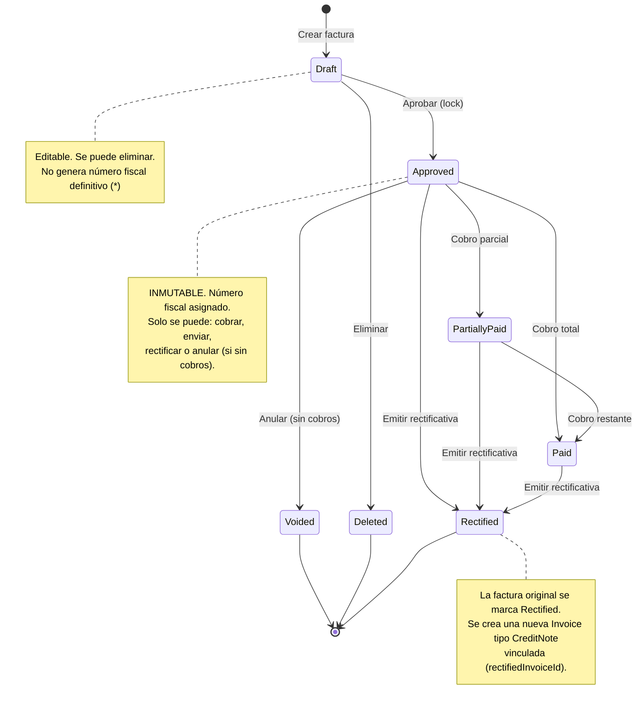
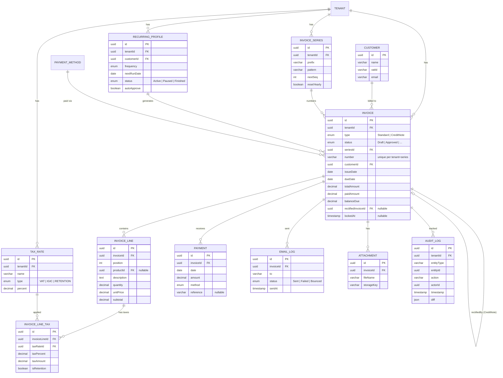

# Módulo "Ventas > Facturas de venta" — Especificación completa

> **Fecha:** 2026-02-16  
> **Versión:** 1.0  
> **Autores:** Product · UX · Tech  
> **Inspiración:** Patrón Holded (rapidez, trazabilidad, ciclo de vida Draft → Approved → Paid)

---

## 0) Supuestos y decisiones

| # | Supuesto / Decisión | Justificación |
|---|----------------------|---------------|
| 1 | **Moneda por defecto EUR**, pero el modelo acepta `currency` por factura. Conversión multi-divisa queda para V2. | El 95 % de PYMES/autónomos españoles facturan en EUR. |
| 2 | **Series alfanuméricas con reset anual configurable** (`FAC-2026-0001`). La inmutabilidad de la serie/número se garantiza al pasar a `Approved`. | Requisito habitual de la AEAT; Holded usa el mismo patrón. |
| 3 | **Inmutabilidad post-aprobación**: una factura aprobada no se puede editar ni eliminar. Las correcciones se hacen vía **Rectifying Invoice (Credit Note)** vinculada. | Trazabilidad fiscal. Es el comportamiento legal estándar en España, aunque la normativa exacta de factura electrónica (TicketBAI, VeriFactu, etc.) varía por comunidad autónoma y está en evolución. |
| 4 | **Impuestos modelados como `TaxRate`** con tipo (IVA, IGIC, IRPF retención) y porcentaje. Se aplican por línea. | Flexibilidad para Canarias (IGIC) y retenciones de autónomos (IRPF). |
| 5 | **Pagos/cobros** se modelan en una entidad `Payment` independiente vinculada N:1 a `Invoice`. Se soportan cobros parciales desde MVP. | Patrón estándar en Holded y otros ERPs. |
| 6 | **RBAC con 4 roles**: `owner`, `admin`, `sales`, `accountant`. `sales` puede crear/editar borradores; `accountant`/`admin` pueden aprobar y registrar cobros; `owner` tiene acceso total. | Mínimo viable para PYME; extensible después con permisos granulares. |
| 7 | **PDF generado server-side** con plantilla configurable (HTML → PDF). El frontend muestra una preview renderizada. | Simplicidad y consistencia; el mismo PDF se adjunta al email. |
| 8 | **AuditLog** registra toda mutación de estado con `actor`, `timestamp`, `action`, `diff`. Es inmutable (append-only). | Requisito de trazabilidad obligatorio. |
| 9 | **Factura recurrente** se modela como `RecurringProfile`, que genera Invoices en `Draft`. El perfil no es factura en sí. | Mismo patrón de Holded/Stripe: el perfil programa, la factura generada sigue el flujo normal. |
| 10 | **Factura electrónica (FacturaE / VeriFactu)**: el modelo incluye campos opcionales (`electronicId`, `qrPayload`, `legalNotices`). La generación/envío a plataformas oficiales queda como V2/integración, ya que los requisitos técnicos exactos varían y están en fase de implantación progresiva. | Se prepara el terreno sin afirmar cumplimiento total; se marca como capacidad configurable. |

---

## 1) IA / Navegación

### Ubicación en el sidebar

```
Catalog
  ├─ Products
  ├─ Collections
  ├─ Inventory
  └─ Orders
Sales          ← NUEVO grupo
  ├─ Invoices   ← módulo principal
  ├─ Quotes     ← placeholder V2
  └─ Recurring  ← sub-vista de Invoices (o entrada propia)
Finances
  ├─ Wallet
  ├─ Uvodo Card
  └─ Payout
Customers
...
```

### Rutas

| Ruta | Vista | MVP |
|------|-------|-----|
| `/invoices` | Listado de facturas | ✅ |
| `/invoices/new` | Editor (crear) | ✅ |
| `/invoices/:id` | Detalle de factura | ✅ |
| `/invoices/:id/edit` | Editor (editar borrador) | ✅ |
| `/invoices/recurring` | Listado perfiles recurrentes | V1 |
| `/invoices/recurring/new` | Editor perfil recurrente | V1 |
| `/invoices/settings` | Config series/plantillas | V1 |

### Breadcrumb

`Sales > Invoices > FAC-2026-0042`

---

## 2) UX por pantalla

### 2.1 Listado

**Layout:** Mismo patrón que `Products.vue` — view-header + filters-bar + table-card.

#### Header

| Elemento | Descripción |
|----------|-------------|
| Título | "Invoices" + `count-badge` con total |
| Botón primario | `+ New invoice` (abre editor) |
| Botón secundario | `Export` (CSV / Excel) |

#### Filtros

| Filtro | Tipo | Opciones |
|--------|------|----------|
| Búsqueda | input text | Por nº factura, cliente, importe |
| Estado | select | All · Draft · Approved · Partially paid · Paid · Overdue · Voided |
| Fecha | date-range picker | Rango de fecha de emisión |
| Cliente | select / autocomplete | Lista de customers |
| Serie | select | Series configuradas |

#### Columnas de la tabla

| Columna | Campo | Clase CSS | Notas |
|---------|-------|-----------|-------|
| ☐ | checkbox | `col-checkbox` | Selección masiva |
| Nº | `number` | `col-number` | Monospace, link al detalle |
| Cliente | `customer.name` | `col-customer` | Con avatar initials |
| Fecha | `issueDate` | `col-date` | `dd/mm/yyyy` |
| Vencimiento | `dueDate` | `col-due` | Rojo si overdue |
| Estado | `status` | `col-status` | Badge con color |
| Total | `totalAmount` | `col-total` | `formatCurrency()` |
| Saldo | `balanceDue` | `col-balance` | Diferencia total – cobrado |
| Acciones | — | `col-actions` | `MoreVertical` menu |

#### Acciones por fila (menú contextual)

- **Ver** → navega a `/invoices/:id`
- **Editar** → solo si `Draft`
- **Duplicar** → crea borrador copia
- **Aprobar** → transición de estado
- **Registrar cobro** → abre modal de pago
- **Enviar por email** → abre modal envío
- **Descargar PDF**
- **Crear rectificativa** → solo si `Approved` / `Paid`
- **Anular** → solo si `Approved` sin cobros

#### Acciones masivas (toolbar que aparece al seleccionar)

- Aprobar seleccionadas (solo drafts)
- Enviar por email
- Exportar seleccionadas
- Eliminar (solo drafts)

#### Paginación

- Server-side, 25 items por defecto (configurable 25/50/100)
- Info: "Showing 1–25 of 342 invoices"

---

### 2.2 Editor

**Layout:** Formulario a pantalla completa con sticky header (botones guardar/aprobar) + sidebar derecha colapsable (resumen de totales).

#### Secciones del formulario

##### A) Cabecera

| Campo | Tipo | Validación | Notas |
|-------|------|------------|-------|
| Serie | select | required | Pre-poblado con serie por defecto |
| Número | auto / manual | readonly si auto | Generado al aprobar si `autoNumber: true` |
| Cliente | autocomplete | required | Busca en `Customer`; botón "+ Nuevo cliente" inline |
| Dirección facturación | auto-fill | — | Se carga del cliente, editable por factura |
| Fecha emisión | datepicker | required, ≤ today | Default: hoy |
| Fecha vencimiento | datepicker | ≥ issueDate | Calculada según forma de pago del cliente |
| Forma de pago | select | required | Transferencia, Domiciliación, Tarjeta, Efectivo, etc. |
| Moneda | select | default EUR | V2: conversión |

##### B) Líneas de factura

| Campo | Tipo | Notas |
|-------|------|-------|
| Producto/Servicio | autocomplete | Busca en `Product`; permite texto libre |
| Descripción | textarea | Auto-fill del producto, editable |
| Cantidad | number | min 0.01, step configurable |
| Precio unitario | number | Pre-fill del producto |
| Descuento | number + select (% / €) | Por línea |
| Impuestos | multi-select tags | IVA 21%, IRPF -15%, etc. |
| Subtotal | computed | `(qty × price) − discount` |

- **Añadir línea:** botón `+ Add line` bajo la última fila.
- **Reordenar:** drag-handle a la izquierda (V1).
- **Eliminar línea:** icono `Trash2` al hover.

##### C) Totales (sidebar o pie)

| Línea | Cálculo |
|-------|---------|
| Subtotal | Σ subtotales de líneas |
| Descuento global | % o € sobre subtotal (opcional) |
| Base imponible | subtotal − descuento global |
| IVA 21% | base × 0.21 (agrupado por tipo) |
| IVA 10% | si aplica |
| IRPF -15% | retención (resta) |
| **Total** | base + impuestos − retenciones |

##### D) Pie

| Campo | Tipo |
|-------|------|
| Notas internas | textarea (no aparece en PDF) |
| Notas para el cliente | textarea (aparece en PDF) |
| Adjuntos | file upload (drag & drop) |

##### E) Botones sticky header

| Botón | Acción | Condición |
|-------|--------|-----------|
| Guardar borrador | Guarda como `Draft` | siempre en modo edición |
| Guardar y aprobar | Guarda → transiciona a `Approved` | validación completa |
| Vista previa PDF | Abre preview en modal | siempre |
| Cancelar | Descarta cambios, navega atrás | siempre |

#### UX clave

- **Cálculo real-time:** cada cambio en qty/price/discount/tax recalcula totales instantáneamente con `computed`.
- **Auto-guardado (V1):** debounce 3s en borradores.
- **Validaciones inline:** borde rojo + mensaje bajo campo; botón "Aprobar" disabled si hay errores.
- **Atajo teclado:** `Ctrl+S` = guardar borrador; `Ctrl+Enter` = guardar y aprobar.

---

### 2.3 Detalle

**Layout:** Dos columnas — contenido principal (izq, 65%) + panel lateral (der, 35%).

#### Columna principal

| Sección | Contenido |
|---------|-----------|
| Header | Nº factura + badge estado + botones acción |
| Preview | Renderizado PDF-like de la factura (datos del cliente, líneas, totales) |
| Timeline | Historial de eventos (creación, aprobación, envíos, cobros, modificaciones) |

#### Panel lateral

| Sección | Contenido |
|---------|-----------|
| **Resumen** | Total, cobrado, saldo pendiente (con barra de progreso) |
| **Acciones** | Aprobar / Registrar cobro / Enviar email / Descargar PDF / Duplicar / Crear rectificativa / Anular |
| **Cobros** | Lista de pagos con fecha, importe, método. Botón `+ Add payment`. |
| **Envíos** | Historial de emails enviados (fecha, destinatario, estado) |
| **Adjuntos** | Archivos vinculados |
| **Datos** | Cliente, fechas, serie, forma de pago, notas |

#### Modal "Registrar cobro"

| Campo | Tipo |
|-------|------|
| Fecha | datepicker (default hoy) |
| Importe | number (default: saldo pendiente) |
| Método | select (Transferencia, Tarjeta, Efectivo, Domiciliación) |
| Referencia | text (nº operación bancaria) |
| Notas | textarea |

- **Cobro parcial:** si el importe < saldo, el estado cambia a `Partially Paid`.
- **Cobro total:** si importe = saldo, estado → `Paid`.

---

### 2.4 Recurrentes

**Scope:** V1

**Layout:** Tabla similar al listado de facturas.

| Columna | Campo |
|---------|-------|
| Nombre | `profileName` |
| Cliente | `customer.name` |
| Intervalo | "Cada 1 mes", "Cada 3 meses"… |
| Próxima generación | `nextRunDate` |
| Estado | Active / Paused / Finished |
| Total | importe de la plantilla |
| Acciones | Editar / Pausar / Ver historial |

#### Editor de perfil recurrente

- Mismos campos que el editor de factura + sección de programación:
  - **Frecuencia:** Diaria / Semanal / Mensual / Trimestral / Anual
  - **Día de generación:** selector (1–28 para mensual)
  - **Fecha inicio / fin:** datepicker (fin opcional → indefinido)
  - **Auto-aprobar:** toggle (genera directamente en `Approved`)
  - **Auto-enviar:** toggle
- **Historial:** tabla de facturas generadas, con link a cada una.

---

### 2.5 Recordatorios

**Scope:** V1

**Layout:** Sección dentro de Configuración o como sub-tab en Invoices.

#### Reglas de recordatorio

| Campo | Tipo |
|-------|------|
| Nombre | text ("Recordatorio 7 días antes") |
| Trigger | select: Antes de vencimiento / Después de vencimiento |
| Días | number |
| Plantilla email | select (de plantillas configuradas) |
| Activo | toggle |
| Máx. envíos | number (evitar spam) |

#### Cadencia por defecto (sugerida)

1. **7 días antes** del vencimiento → recordatorio amable
2. **Día del vencimiento** → aviso de vencimiento
3. **7 días después** → primer recordatorio de impago
4. **30 días después** → segundo recordatorio (tono firme)

#### Log de recordatorios

Tabla: factura, cliente, fecha envío, plantilla usada, resultado (enviado / error / bounce).

---

### 2.6 Configuración

**Scope:** V1

**Layout:** Página de settings con pestañas/accordion.

#### Tab 1: Series y numeración

| Campo | Tipo | Ejemplo |
|-------|------|---------|
| Nombre de serie | text | "Facturas generales" |
| Prefijo | text | `FAC` |
| Formato número | pattern | `{PREFIX}-{YEAR}-{SEQ:4}` → `FAC-2026-0001` |
| Siguiente número | number | 42 |
| Reset anual | toggle | Sí (reinicia seq a 1 cada 1 de enero) |
| Por defecto | toggle | Una serie marcada como default |

#### Tab 2: Formas de pago

| Campo | Tipo |
|-------|------|
| Nombre | text ("Transferencia 30 días") |
| Tipo | select (Transfer, DirectDebit, Card, Cash, Other) |
| Días vencimiento | number (0 = contado) |
| Cuenta tesorería | select (link a cuentas de Wallet) |
| Activa | toggle |

#### Tab 3: Plantillas PDF

| Campo | Tipo |
|-------|------|
| Nombre | text |
| Logo | file upload |
| Colores | color pickers (primary, accent) |
| Pie de página | rich text (datos fiscales, IBAN, etc.) |
| Por defecto | toggle |

#### Tab 4: Email

| Campo | Tipo |
|-------|------|
| Remitente | text (email) |
| Asunto por defecto | text con variables (`{{invoice_number}}`, `{{customer_name}}`) |
| Cuerpo por defecto | rich text con variables |

---

## 3) Estado y transiciones

### Diagrama de estados



> (*) Decisión: los borradores pueden tener número provisional o generarlo solo al aprobar. Se recomienda generar al aprobar para evitar saltos en la numeración.

### Tabla de transiciones

| Desde | Hacia | Acción | Rol mínimo | Side-effects |
|-------|-------|--------|-----------|--------------|
| — | Draft | Crear | `sales` | AuditLog: `invoice.created` |
| Draft | Draft | Editar | `sales` | AuditLog: `invoice.updated` + diff |
| Draft | Approved | Aprobar | `accountant` | Lock, asignar número fiscal, AuditLog: `invoice.approved` |
| Draft | Deleted | Eliminar | `sales` | Soft-delete, AuditLog: `invoice.deleted` |
| Approved | PartiallyPaid | Registrar cobro parcial | `accountant` | Crear Payment, recalcular `balanceDue`, AuditLog |
| Approved | Paid | Registrar cobro total | `accountant` | Crear Payment, `balanceDue = 0`, AuditLog |
| Approved | Voided | Anular | `admin` | Solo si `payments.length === 0`, AuditLog |
| Approved | Rectified | Crear rectificativa | `accountant` | Crear CreditNote vinculada, marcar original como Rectified |
| PartiallyPaid | Paid | Cobro restante | `accountant` | Payment, AuditLog |
| PartiallyPaid / Paid | Rectified | Crear rectificativa | `accountant` | CreditNote, AuditLog |

### Detección de "Overdue"

`Overdue` no es un estado persistido; es un **estado derivado** calculado en queries:

```
IF status IN ('Approved', 'PartiallyPaid') AND dueDate < NOW() → mostrar badge "Overdue"
```

Esto evita jobs de actualización y es consistente con el patrón de Holded.

---

## 4) Modelo de datos

### Entidades principales

#### Invoice

| Campo | Tipo | Notas |
|-------|------|-------|
| `id` | UUID / PK | |
| `tenantId` | UUID / FK | Multi-tenant |
| `type` | ENUM(`Standard`, `CreditNote`) | |
| `status` | ENUM(`Draft`, `Approved`, `PartiallyPaid`, `Paid`, `Voided`, `Rectified`, `Deleted`) | |
| `seriesId` | UUID / FK → `InvoiceSeries` | |
| `number` | VARCHAR(30) | Único por tenant+series, null en Draft si auto-number |
| `customerId` | UUID / FK → `Customer` | |
| `customerName` | VARCHAR | Snapshot al aprobar (desnormalización para auditoría) |
| `customerVatId` | VARCHAR | Snapshot |
| `customerAddress` | JSON | Snapshot |
| `issueDate` | DATE | |
| `dueDate` | DATE | |
| `paymentMethodId` | UUID / FK → `PaymentMethod` | |
| `currency` | CHAR(3) | Default `EUR` |
| `subtotal` | DECIMAL(12,2) | Σ líneas |
| `discountType` | ENUM(`percent`, `fixed`) / NULL | Descuento global |
| `discountValue` | DECIMAL(12,2) / NULL | |
| `discountAmount` | DECIMAL(12,2) | Calculado |
| `taxBase` | DECIMAL(12,2) | subtotal − discount |
| `totalTax` | DECIMAL(12,2) | Σ impuestos |
| `totalRetention` | DECIMAL(12,2) | Σ retenciones (IRPF) |
| `totalAmount` | DECIMAL(12,2) | taxBase + totalTax − totalRetention |
| `paidAmount` | DECIMAL(12,2) | Σ payments |
| `balanceDue` | DECIMAL(12,2) | totalAmount − paidAmount |
| `customerNotes` | TEXT | Visible en PDF |
| `internalNotes` | TEXT | Solo backend/UI |
| `rectifiedInvoiceId` | UUID / FK → `Invoice` / NULL | Si es CreditNote, apunta a la factura original |
| `recurringProfileId` | UUID / FK / NULL | Si fue generada por perfil recurrente |
| `electronicId` | VARCHAR / NULL | ID de factura electrónica (V2) |
| `qrPayload` | TEXT / NULL | Datos para QR de verificación (V2) |
| `legalNotices` | TEXT / NULL | Leyendas legales configurables |
| `lockedAt` | TIMESTAMP / NULL | Momento de aprobación (lock) |
| `lockedBy` | UUID / FK → `User` / NULL | |
| `createdBy` | UUID / FK → `User` | |
| `createdAt` | TIMESTAMP | |
| `updatedBy` | UUID / FK → `User` | |
| `updatedAt` | TIMESTAMP | |

#### InvoiceLine

| Campo | Tipo | Notas |
|-------|------|-------|
| `id` | UUID / PK | |
| `invoiceId` | UUID / FK → `Invoice` | |
| `position` | INT | Orden de la línea |
| `productId` | UUID / FK → `Product` / NULL | Puede ser texto libre |
| `description` | TEXT | |
| `quantity` | DECIMAL(10,3) | |
| `unitPrice` | DECIMAL(12,4) | |
| `discountType` | ENUM(`percent`, `fixed`) / NULL | |
| `discountValue` | DECIMAL(12,2) / NULL | |
| `discountAmount` | DECIMAL(12,2) | |
| `subtotal` | DECIMAL(12,2) | (qty × unitPrice) − discount |

#### InvoiceLineTax

| Campo | Tipo | Notas |
|-------|------|-------|
| `id` | UUID / PK | |
| `invoiceLineId` | UUID / FK | |
| `taxRateId` | UUID / FK → `TaxRate` | |
| `taxName` | VARCHAR | Snapshot ("IVA 21%") |
| `taxPercent` | DECIMAL(5,2) | Snapshot |
| `isRetention` | BOOLEAN | true para IRPF |
| `taxAmount` | DECIMAL(12,2) | Calculado |

#### TaxRate

| Campo | Tipo | Notas |
|-------|------|-------|
| `id` | UUID / PK | |
| `tenantId` | UUID | |
| `name` | VARCHAR | "IVA 21%", "IGIC 7%", "IRPF -15%" |
| `type` | ENUM(`VAT`, `IGIC`, `RETENTION`) | |
| `percent` | DECIMAL(5,2) | Puede ser negativo para retenciones |
| `isDefault` | BOOLEAN | |
| `active` | BOOLEAN | |

#### Payment

| Campo | Tipo | Notas |
|-------|------|-------|
| `id` | UUID / PK | |
| `tenantId` | UUID | |
| `invoiceId` | UUID / FK → `Invoice` | |
| `date` | DATE | |
| `amount` | DECIMAL(12,2) | |
| `method` | ENUM(`Transfer`, `DirectDebit`, `Card`, `Cash`, `Other`) | |
| `reference` | VARCHAR / NULL | Nº operación bancaria |
| `treasuryAccountId` | UUID / FK / NULL | Cuenta de tesorería |
| `notes` | TEXT / NULL | |
| `createdBy` | UUID / FK → `User` | |
| `createdAt` | TIMESTAMP | |

#### InvoiceSeries

| Campo | Tipo | Notas |
|-------|------|-------|
| `id` | UUID / PK | |
| `tenantId` | UUID | |
| `name` | VARCHAR | "Facturas generales" |
| `prefix` | VARCHAR(10) | `FAC` |
| `pattern` | VARCHAR(50) | `{PREFIX}-{YEAR}-{SEQ:4}` |
| `nextSeq` | INT | Auto-increment por tenant+series+year |
| `resetYearly` | BOOLEAN | |
| `isDefault` | BOOLEAN | |
| `active` | BOOLEAN | |

#### RecurringProfile

| Campo | Tipo | Notas |
|-------|------|-------|
| `id` | UUID / PK | |
| `tenantId` | UUID | |
| `name` | VARCHAR | |
| `customerId` | UUID / FK | |
| `templateData` | JSON | Snapshot de líneas, impuestos, notas |
| `frequency` | ENUM(`Daily`, `Weekly`, `Monthly`, `Quarterly`, `Yearly`) | |
| `dayOfPeriod` | INT / NULL | Día del mes (1-28) |
| `startDate` | DATE | |
| `endDate` | DATE / NULL | NULL = indefinido |
| `nextRunDate` | DATE | |
| `autoApprove` | BOOLEAN | |
| `autoSend` | BOOLEAN | |
| `status` | ENUM(`Active`, `Paused`, `Finished`) | |
| `createdBy` | UUID / FK | |
| `createdAt` | TIMESTAMP | |

#### EmailLog

| Campo | Tipo | Notas |
|-------|------|-------|
| `id` | UUID / PK | |
| `invoiceId` | UUID / FK | |
| `to` | VARCHAR | |
| `cc` | VARCHAR / NULL | |
| `subject` | VARCHAR | |
| `templateUsed` | VARCHAR | |
| `status` | ENUM(`Sent`, `Failed`, `Bounced`) | |
| `sentAt` | TIMESTAMP | |
| `sentBy` | UUID / FK → `User` | |
| `errorDetail` | TEXT / NULL | |

#### AuditLog

| Campo | Tipo | Notas |
|-------|------|-------|
| `id` | UUID / PK | |
| `tenantId` | UUID | |
| `entityType` | VARCHAR | `Invoice`, `Payment`, etc. |
| `entityId` | UUID | |
| `action` | VARCHAR | `created`, `updated`, `approved`, `payment.added`, etc. |
| `actorId` | UUID / FK → `User` | |
| `actorName` | VARCHAR | Snapshot |
| `timestamp` | TIMESTAMP | |
| `diff` | JSON / NULL | `{ field: { old, new } }` |
| `metadata` | JSON / NULL | Datos adicionales (IP, user-agent, etc.) |

#### Attachment

| Campo | Tipo | Notas |
|-------|------|-------|
| `id` | UUID / PK | |
| `invoiceId` | UUID / FK | |
| `fileName` | VARCHAR | |
| `fileSize` | INT | Bytes |
| `mimeType` | VARCHAR | |
| `storageKey` | VARCHAR | Path en object storage |
| `uploadedBy` | UUID / FK → `User` | |
| `uploadedAt` | TIMESTAMP | |

### Diagrama ER



---

## 5) Reglas de negocio y edge cases

### Reglas fundamentales

| # | Regla | Enforcement |
|---|-------|-------------|
| R1 | **Inmutabilidad post-lock:** Tras `Approved`, todos los campos de `Invoice` e `InvoiceLine` son de solo lectura. | API rechaza PUT/PATCH con `409 Conflict` si `status ≠ Draft`. |
| R2 | **Número fiscal único:** `(tenantId, seriesId, number)` es UNIQUE. Se asigna al aprobar. | Constraint de BD + lógica transaccional. |
| R3 | **No eliminar facturas aprobadas.** Solo se permite soft-delete de borradores. | API valida estado antes de DELETE. |
| R4 | **Cobro ≤ saldo pendiente:** `payment.amount ≤ invoice.balanceDue`. | Validación en API; rechaza con `422`. |
| R5 | **Cobro solo en facturas aprobadas:** `status IN (Approved, PartiallyPaid)`. | Validación en API. |
| R6 | **Anulación solo sin cobros:** `Voided` requiere `paidAmount === 0`. | Validación en API. |
| R7 | **Rectificativa vinculada:** Una CreditNote siempre tiene `rectifiedInvoiceId` apuntando a la original. | FK NOT NULL para type=CreditNote. |
| R8 | **Impuestos por línea:** Cada línea puede tener N impuestos/retenciones. El total se agrupa en la factura. | Cálculo en API y validación de coherencia. |
| R9 | **Fechas coherentes:** `dueDate ≥ issueDate`. | Validación front + back. |
| R10 | **Descuento global + por línea:** Son acumulativos. Descuento global se aplica sobre subtotal (Σ líneas ya descontadas). | Documentar orden de cálculo. |

### Edge cases

| Caso | Comportamiento |
|------|---------------|
| **Cliente eliminado después de facturar** | Los datos del cliente están snapshotted en la factura (`customerName`, `customerVatId`, `customerAddress`). La factura permanece intacta. |
| **Cambio de tipo impositivo** | Los `TaxRate` son snapshots por línea (`taxPercent` en `InvoiceLineTax`). Un cambio en la configuración no afecta facturas existentes. |
| **Factura con saldo 0 que recibe otro cobro** | API rechaza con `422: Invoice already fully paid`. |
| **Rectificativa de rectificativa** | Permitido: una CreditNote puede ser rectificada a su vez, creando una cadena. Cada una apunta a la anterior. |
| **Serie desactivada** | No se pueden crear nuevas facturas con esa serie. Las existentes no se afectan. |
| **Perfil recurrente con cliente inactivo** | El job genera la factura en Draft pero no la auto-aprueba; envía alerta al tenant. |
| **Numeración concurrente** | Usar `SELECT ... FOR UPDATE` o secuencia de BD para evitar duplicados en `nextSeq`. |
| **Factura a 0 €** | Permitido (e.g., muestras gratuitas). Estado salta directamente a `Paid` al aprobar, o se requiere cobro simbólico según config del tenant. Decisión: permitir y auto-marcar como `Paid`. |
| **Moneda diferente al EUR** | V2. Mientras tanto, el campo existe pero se fija a EUR y la UI no muestra selector de moneda en MVP. |

---

## 6) API REST

**Base:** `/api/v1/invoices`

### Endpoints principales

| Endpoint | Método | Descripción | Roles | Idempotencia | Errores clave |
|----------|--------|-------------|-------|-------------|---------------|
| `/invoices` | `GET` | Listar facturas (paginado, filtros) | all | — | — |
| `/invoices` | `POST` | Crear borrador | `sales+` | `Idempotency-Key` header | `422` validación |
| `/invoices/:id` | `GET` | Obtener detalle | all | — | `404` |
| `/invoices/:id` | `PUT` | Actualizar borrador | `sales+` | — | `409` si no es Draft, `404` |
| `/invoices/:id` | `DELETE` | Eliminar borrador (soft) | `sales+` | — | `409` si no es Draft |
| `/invoices/:id/approve` | `POST` | Aprobar (lock + asignar nº) | `accountant+` | Idempotent (si ya Approved → 200) | `409` si no es Draft, `422` validación |
| `/invoices/:id/void` | `POST` | Anular | `admin+` | — | `409` si tiene cobros |
| `/invoices/:id/duplicate` | `POST` | Duplicar como nuevo Draft | `sales+` | `Idempotency-Key` | — |
| `/invoices/:id/rectify` | `POST` | Crear rectificativa (CreditNote) | `accountant+` | `Idempotency-Key` | `409` si es Draft/Voided |
| `/invoices/:id/pdf` | `GET` | Descargar PDF | all | — | — |
| `/invoices/:id/preview` | `GET` | Preview HTML del PDF | all | — | — |
| `/invoices/:id/send` | `POST` | Enviar por email | `sales+` | `Idempotency-Key` | `422` si no tiene email |
| **Payments** | | | | | |
| `/invoices/:id/payments` | `GET` | Listar cobros | `accountant+` | — | — |
| `/invoices/:id/payments` | `POST` | Registrar cobro | `accountant+` | `Idempotency-Key` | `422` si amount > balance |
| `/invoices/:id/payments/:pid` | `DELETE` | Eliminar cobro | `admin+` | — | `409` si factura rectificada |
| **Attachments** | | | | | |
| `/invoices/:id/attachments` | `POST` | Subir adjunto | `sales+` | — | `413` tamaño |
| `/invoices/:id/attachments/:aid` | `DELETE` | Eliminar adjunto | `sales+` | — | `409` si locked |
| **Recurring** | | | | | |
| `/recurring-profiles` | `GET` | Listar perfiles | `accountant+` | — | — |
| `/recurring-profiles` | `POST` | Crear perfil | `accountant+` | `Idempotency-Key` | `422` |
| `/recurring-profiles/:id` | `PUT` | Editar perfil | `accountant+` | — | — |
| `/recurring-profiles/:id/pause` | `POST` | Pausar | `accountant+` | Idempotent | — |
| `/recurring-profiles/:id/resume` | `POST` | Reanudar | `accountant+` | Idempotent | — |
| **Config** | | | | | |
| `/invoice-series` | `GET` | Listar series | `admin+` | — | — |
| `/invoice-series` | `POST` | Crear serie | `admin+` | — | `422` |
| `/invoice-series/:id` | `PUT` | Editar serie | `admin+` | — | — |
| `/tax-rates` | `GET` | Listar tipos impositivos | all | — | — |
| `/tax-rates` | `POST` | Crear | `admin+` | — | — |
| `/payment-methods` | `GET` | Listar formas de pago | all | — | — |
| **Audit** | | | | | |
| `/invoices/:id/audit-log` | `GET` | Timeline de auditoría | `accountant+` | — | — |
| `/invoices/:id/email-log` | `GET` | Historial de envíos | `sales+` | — | — |

### Query params comunes para `GET /invoices`

```
?page=1
&perPage=25
&status=approved,partially_paid
&customerId=uuid
&seriesId=uuid
&issueDateFrom=2026-01-01
&issueDateTo=2026-02-28
&dueDateFrom=...
&dueDateTo=...
&overdue=true              // filtro derivado: dueDate < now AND status in (approved, partially_paid)
&search=FAC-2026           // búsqueda full-text en number, customerName
&sort=issueDate
&order=desc
```

### Response ejemplo `GET /invoices/:id`

```jsonc
{
  "id": "uuid",
  "type": "Standard",
  "status": "Approved",
  "number": "FAC-2026-0042",
  "series": { "id": "uuid", "name": "Facturas generales", "prefix": "FAC" },
  "customer": { "id": "uuid", "name": "Acme Corp.", "vatId": "B-12345678" },
  "issueDate": "2026-02-10",
  "dueDate": "2026-03-12",
  "paymentMethod": { "id": "uuid", "name": "Transferencia 30 días" },
  "currency": "EUR",
  "lines": [
    {
      "id": "uuid",
      "position": 1,
      "productId": "uuid",
      "description": "Camiseta Algodón Orgánico",
      "quantity": 10,
      "unitPrice": 29.99,
      "discountType": "percent",
      "discountValue": 5,
      "discountAmount": 15.00,
      "subtotal": 284.90,
      "taxes": [
        { "taxRateId": "uuid", "name": "IVA 21%", "percent": 21, "isRetention": false, "amount": 59.83 }
      ]
    }
  ],
  "subtotal": 284.90,
  "discountType": null,
  "discountValue": null,
  "discountAmount": 0,
  "taxBase": 284.90,
  "taxSummary": [
    { "name": "IVA 21%", "base": 284.90, "amount": 59.83 }
  ],
  "totalTax": 59.83,
  "totalRetention": 0,
  "totalAmount": 344.73,
  "paidAmount": 100.00,
  "balanceDue": 244.73,
  "payments": [
    { "id": "uuid", "date": "2026-02-15", "amount": 100.00, "method": "Transfer", "reference": "OP-12345" }
  ],
  "customerNotes": "Entrega en almacén central.",
  "internalNotes": "Cliente prioritario.",
  "rectifiedInvoiceId": null,
  "lockedAt": "2026-02-10T14:30:00Z",
  "lockedBy": { "id": "uuid", "name": "Ana G." },
  "createdAt": "2026-02-10T10:00:00Z",
  "updatedAt": "2026-02-15T09:00:00Z"
}
```

---

## 7) Eventos / Webhooks

### Lista de eventos de dominio

| Evento | Trigger | Payload mínimo |
|--------|---------|----------------|
| `invoice.created` | POST /invoices | `{ invoiceId, tenantId, type, customerId, totalAmount, createdBy }` |
| `invoice.updated` | PUT /invoices/:id | `{ invoiceId, tenantId, changedFields[], updatedBy }` |
| `invoice.approved` | POST /invoices/:id/approve | `{ invoiceId, tenantId, number, customerId, totalAmount, approvedBy, approvedAt }` |
| `invoice.voided` | POST /invoices/:id/void | `{ invoiceId, tenantId, number, voidedBy, reason }` |
| `invoice.rectified` | POST /invoices/:id/rectify | `{ invoiceId, tenantId, creditNoteId, creditNoteNumber, amount }` |
| `invoice.deleted` | DELETE /invoices/:id | `{ invoiceId, tenantId, deletedBy }` |
| `invoice.sent` | POST /invoices/:id/send | `{ invoiceId, tenantId, to, sentBy, sentAt }` |
| `invoice.overdue` | Cron / derivado | `{ invoiceId, tenantId, number, customerId, dueDate, balanceDue, daysOverdue }` |
| `payment.created` | POST /invoices/:id/payments | `{ paymentId, invoiceId, tenantId, amount, method, newBalance, newStatus }` |
| `payment.deleted` | DELETE .../payments/:pid | `{ paymentId, invoiceId, tenantId, amount, newBalance, newStatus }` |
| `recurring.generated` | Cron job | `{ profileId, invoiceId, tenantId, customerId, totalAmount }` |
| `recurring.failed` | Cron job error | `{ profileId, tenantId, error }` |
| `reminder.sent` | Reminder engine | `{ invoiceId, tenantId, reminderRuleId, to, sentAt }` |

### Formato del webhook

```jsonc
{
  "event": "invoice.approved",
  "timestamp": "2026-02-10T14:30:00Z",
  "tenantId": "uuid",
  "payload": {
    "invoiceId": "uuid",
    "number": "FAC-2026-0042",
    "customerId": "uuid",
    "totalAmount": 344.73,
    "approvedBy": "uuid",
    "approvedAt": "2026-02-10T14:30:00Z"
  },
  "deliveryId": "uuid"  // para idempotencia del receptor
}
```

- **Retry policy:** 3 reintentos con backoff exponencial (1s, 10s, 60s).
- **Firma:** HMAC-SHA256 en header `X-Webhook-Signature` con secret por tenant.
- **Registro:** cada intento se guarda en `WebhookDeliveryLog` (URL, status code, response time).

---

## 8) Checklist MVP (producción)

### Seguridad

- [ ] Autenticación JWT con refresh tokens
- [ ] Multi-tenant isolation: **todas** las queries filtran por `tenantId`
- [ ] RBAC middleware: validar rol en cada endpoint
- [ ] Rate limiting por tenant (e.g., 100 req/min)
- [ ] Input sanitization (XSS, SQL injection)
- [ ] Validar `Content-Type` y tamaño de uploads (máx. 10 MB)
- [ ] CORS configurado solo para dominios permitidos
- [ ] HTTPS obligatorio

### Permisos (RBAC)

- [ ] `sales`: crear/editar/eliminar borradores, enviar email, descargar PDF
- [ ] `accountant`: todo lo de sales + aprobar, registrar/eliminar cobros, crear rectificativa, ver audit log
- [ ] `admin`: todo lo de accountant + anular facturas, gestionar series/config, eliminar cobros
- [ ] `owner`: acceso total
- [ ] Tests de autorización: un `sales` NO puede aprobar ni registrar cobros

### Auditoría

- [ ] `AuditLog` registra toda mutación con `actor`, `timestamp`, `action`, `diff`
- [ ] `AuditLog` es append-only (no UPDATE ni DELETE)
- [ ] Timeline visible en el detalle de factura
- [ ] `EmailLog` registra todos los envíos
- [ ] Logs de webhook delivery

### Numeración

- [ ] Serie + número únicos por tenant (`UNIQUE(tenantId, seriesId, number)`)
- [ ] Número asignado **al aprobar**, no al crear borrador
- [ ] Concurrencia: lock pessimista (`SELECT ... FOR UPDATE`) o secuencia de BD
- [ ] Reset anual de secuencia configurable
- [ ] Test: crear 100 facturas concurrentes → sin duplicados

### PDF

- [ ] Generación server-side (HTML → PDF, e.g., Puppeteer o wkhtmltopdf)
- [ ] Plantilla con datos fiscales del tenant (NIF, dirección, logo)
- [ ] Datos del cliente, líneas, impuestos agrupados, totales
- [ ] Notas para el cliente visibles; notas internas NO
- [ ] Preview en UI antes de aprobar
- [ ] PDF regenerable pero con marca de agua "BORRADOR" si status = Draft

### Email

- [ ] Envío con adjunto PDF + adjuntos opcionales del usuario
- [ ] Plantilla configurable con variables (`{{invoice_number}}`, `{{customer_name}}`, `{{total}}`, `{{due_date}}`)
- [ ] Registro en `EmailLog` (to, subject, status, timestamp)
- [ ] Gestión de errores: reintentos + feedback en UI
- [ ] Configurar SPF/DKIM para el dominio de envío

### Pagos / Cobros

- [ ] Cobro parcial: actualiza `paidAmount`, `balanceDue`, status → `PartiallyPaid`
- [ ] Cobro total: status → `Paid`
- [ ] Validación: `amount > 0 AND amount ≤ balanceDue`
- [ ] Solo en facturas `Approved` o `PartiallyPaid`
- [ ] Eliminar cobro: recalcula saldo y revierte status si necesario
- [ ] Eliminar cobro solo permitido a `admin+`

### Inmutabilidad y correcciones

- [ ] Factura `Approved`: rechazar cualquier PUT/PATCH con `409`
- [ ] Rectificativa: crea CreditNote vinculada, marca original como `Rectified`
- [ ] Anulación: solo si `paidAmount === 0`
- [ ] Los snapshots de cliente/impuestos se guardan en la factura

### Rendimiento

- [ ] Índices de BD: `(tenantId, status)`, `(tenantId, customerId)`, `(tenantId, issueDate)`, `(tenantId, seriesId, number)`
- [ ] Paginación server-side obligatoria (cursor o offset)
- [ ] Bulk operations (aprobar masivo) en transacción con límite (máx. 50)
- [ ] Caché de PDFs generados (invalidar al cambiar estado)

### Tests mínimos

- [ ] Unit: cálculo de totales (líneas + impuestos + descuentos + retenciones)
- [ ] Unit: máquina de estados (transiciones válidas e inválidas)
- [ ] Integration: crear → editar → aprobar → cobrar → rectificar
- [ ] Integration: numeración concurrente
- [ ] E2E: flujo completo en UI (crear borrador → aprobar → enviar → cobrar)
- [ ] Authorization: cada endpoint con cada rol

### Roadmap de fases

| Feature | MVP | V1 | V2 |
|---------|-----|----|----|
| CRUD facturas (Draft/Approved) | ✅ | | |
| Cobros parciales/totales | ✅ | | |
| PDF + preview | ✅ | | |
| Email con PDF | ✅ | | |
| Rectificativa (CreditNote) | ✅ | | |
| Anulación | ✅ | | |
| AuditLog + Timeline | ✅ | | |
| RBAC (4 roles) | ✅ | | |
| Listado con filtros + paginación | ✅ | | |
| Series y numeración | ✅ | | |
| Perfiles recurrentes | | ✅ | |
| Recordatorios de pago | | ✅ | |
| Plantillas PDF configurables | | ✅ | |
| Auto-guardado borradores | | ✅ | |
| Drag-reorder líneas | | ✅ | |
| Webhooks | | ✅ | |
| Multi-divisa | | | ✅ |
| Factura electrónica (FacturaE) | | | ✅ |
| Portal del cliente | | | ✅ |
| Conciliación bancaria automática | | | ✅ |
| Integración contable | | | ✅ |

---

> **Nota sobre factura electrónica:** Los campos `electronicId`, `qrPayload` y `legalNotices` están preparados en el modelo. La implementación de VeriFactu / TicketBAI / FacturaE requiere verificar los requisitos técnicos exactos vigentes en el momento de desarrollo, ya que la normativa española está en fase de despliegue progresivo. Se recomienda tratar estos campos como **capacidades configurables** ("modo compliance") que se activan cuando el tenant lo requiera.
